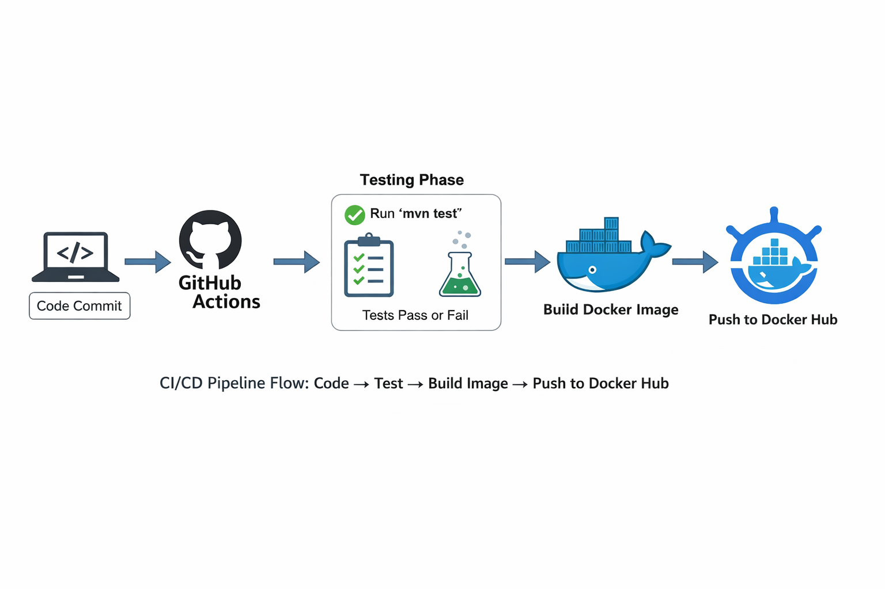

# qa-final-project


# Descriere proiect

Acest proiect prezintă un workflow complet pentru un proiect Java/Maven, urmând bune practici de organizare, testare și CI/CD.

**Pipeline CI cu GitHub Actions:**

- La fiecare push, testele sunt rulate automat cu Maven (`mvn test`)
- Dacă testele trec, se construiește o imagine Docker pe baza Dockerfile-ului
- Pipeline-ul se autentifică în Docker Hub folosind GitHub Secrets și face push imaginii
- Aplicația devine astfel disponibilă ca imagine containerizată

**Componente principale ale proiectului:**

- Structură Maven corectă: `src/test/java/...`, `config/`, `data/`
- Fișier YAML: `config/app.yaml` pentru configurarea mediului, URL-urilor și timeout-urilor
- Teste API în pseudocod: `ApiTest.txt`, pentru a demonstra logica testării fără cod executabil
- Dockerfile pentru build și rulare în container izolat
- Pipeline GitHub Actions: `.github/workflows/ci.yml` pentru automatizarea testelor și publicarea imaginii Docker

## Structura proiectului

```
qa-final-project-java/
├── config/
│   └── app.yaml
├── data/
├── src/test/java/com/<username>/tests/
├── .github/workflows/
│   └── ci.yml
├── ApiTest.txt
├── Dockerfile
├── pom.xml
└── README.md
```

---

## Dockerfile

```
# Folosim imaginea Maven cu JDK 17
FROM maven:3.8.4-openjdk-17

# Setăm directorul de lucru în container
WORKDIR /app

# Copiem pom.xml și fișierele de configurare
COPY pom.xml .
COPY config/app.yaml ./config/

# Copiem sursele test
COPY src ./src

# Construim proiectul fără să rulăm testele
RUN mvn clean install -DskipTests

# Comanda care se rulează când pornește containerul
CMD ["mvn", "test"]
```

---

## Cum rulez testele local

### 1. Rulare directă cu Maven

```bash
mvn test
```

- Rulează testele definite în `src/test/java/...`.
- Testele sunt pseudocod → comanda trece cu succes fără teste reale.

### 2. Rulare folosind Docker

```bash
docker build -t qa-final-project-java .
docker run qa-final-project-java
```

- `docker build` creează o imagine care include codul și toate dependențele.
- `docker run` pornește un container izolat care rulează `mvn test`.
- Pentru proiectul curent, nu este nevoie de `--no-cache`; poate fi adăugat dacă proiectul se modifică frecvent.

---

## Docker în CI/CD – Flux end-to-end după git push

1. **Push cod pe GitHub**

```bash
git push origin main
```

- GitHub detectează modificarea și pornește workflow-ul CI/CD definit în `.github/workflows/ci.yml`.

2. **Job test (verificarea codului)**

- Rulează `mvn test` într-un mediu curat și identic pentru toți.
- Dacă testele trec → pipeline-ul continuă la job-ul următor.
- Dacă testele eșuează → workflow-ul se oprește și imaginea Docker nu se publică.

3. **Job build-and-push (Docker)**

- Construirea imaginii Docker și autentificarea pe Docker Hub folosesc **GitHub Secrets**: `DOCKERHUB_USERNAME` și `DOCKERHUB_TOKEN`.
- Secrets sunt stocate securizat în GitHub și nu pot fi vizualizate după ce au fost create.
- Dacă job-ul `build-and-push` rulează fără erori, înseamnă că secrets există și sunt corecte.
- Secrets nu pot fi accesate local; ele funcționează doar în GitHub Actions.

**Notă:** Valorile secretelor nu trebuie vizualizate; pipeline-ul le folosește automat pentru autentificarea și push-ul imaginii Docker.

```text
Cod sursă
│
▼
┌────────────────────────────┐
│ Job Test                   │
│ Run 'mvn test'             │
│ Pass → continuă            │
│ Fail → oprește             │
└────────────────────────────┘
│
▼
┌────────────────────────────┐
│ Build Docker Image         │
│ Dockerfile                 │
│ docker build               │
└────────────────────────────┘
│
▼
┌────────────────────────────┐
│ Docker Login               │
│ docker login               │
│ (GitHub Secrets)           │
└────────────────────────────┘
│
▼
┌────────────────────────────┐
│ Push to Docker Hub         │
│ docker push                │
└────────────────────────────┘
│
▼
Docker Hub (Image disponibilă)
```


